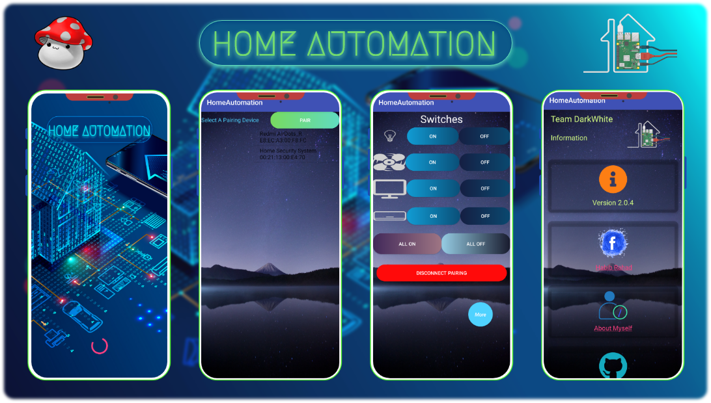
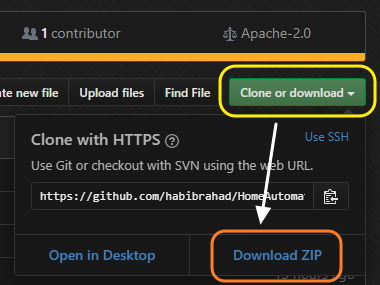
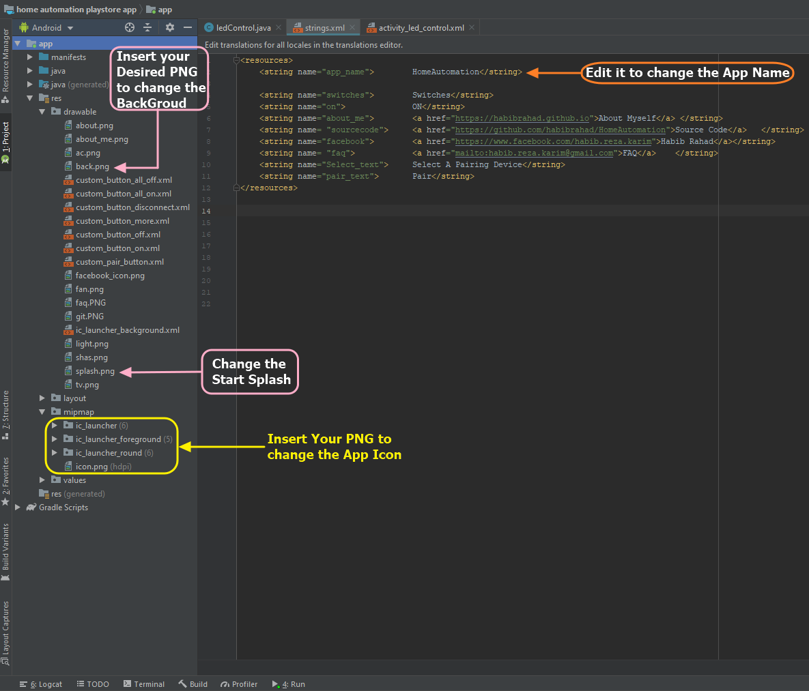
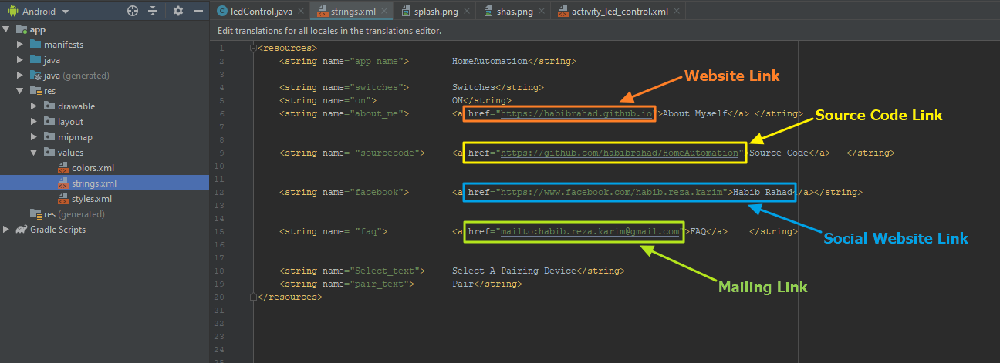
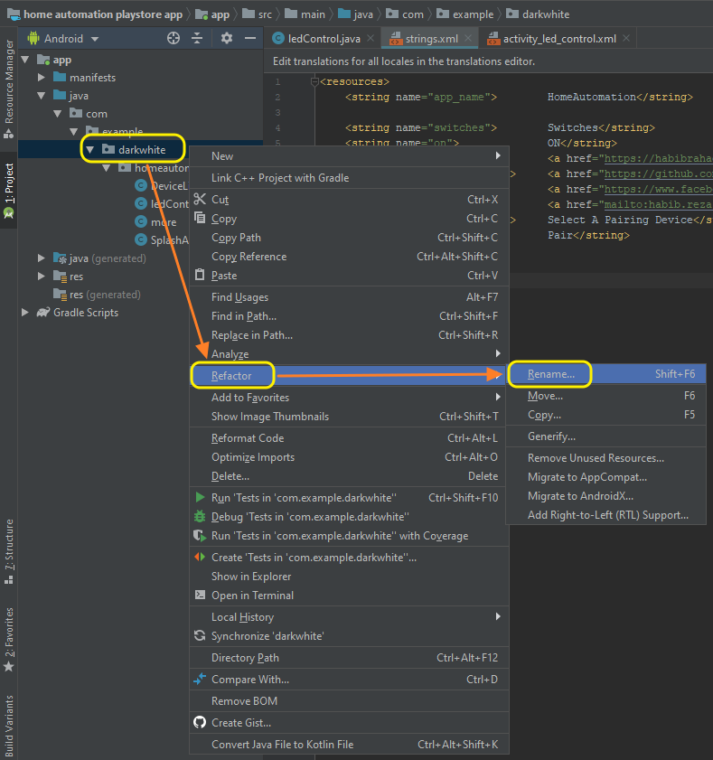
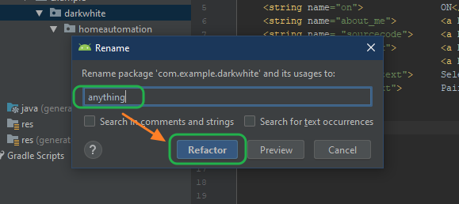
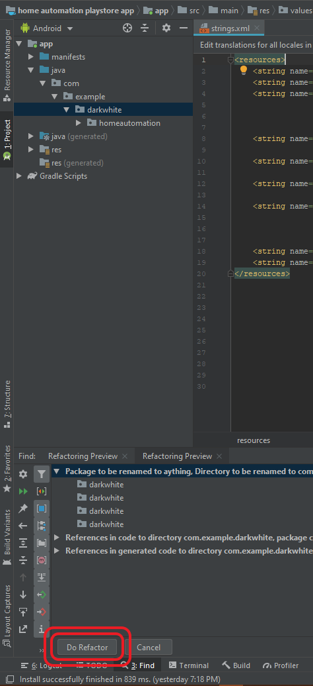
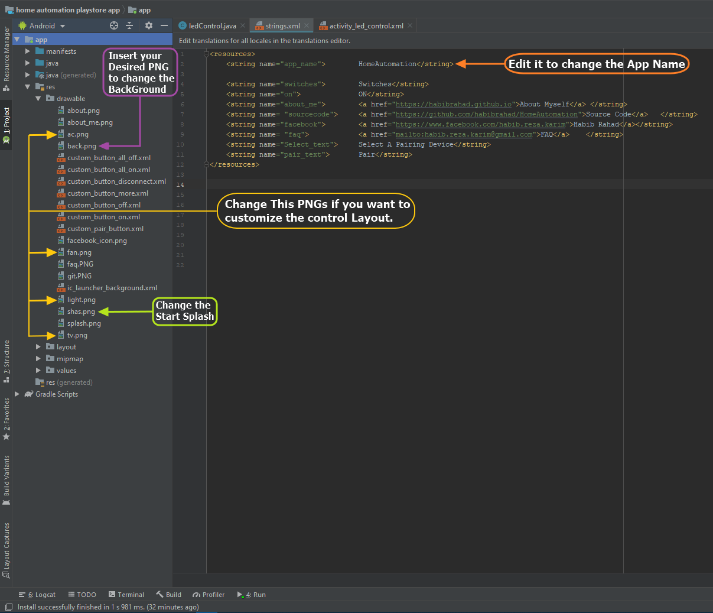
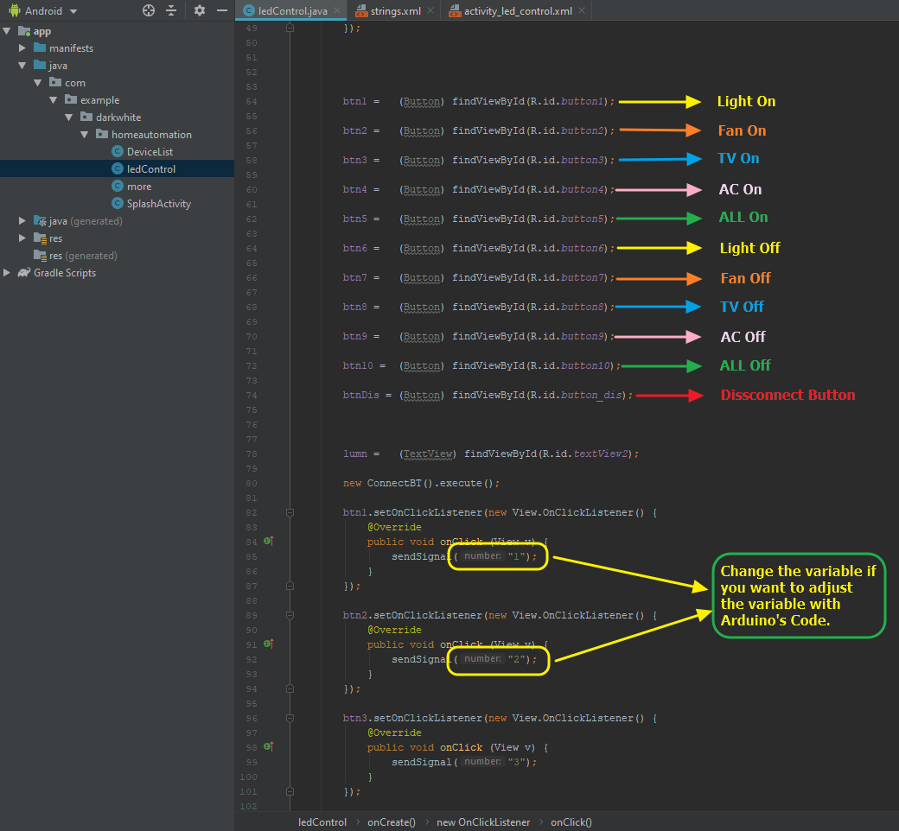

<html>

<head>
<link rel="stylesheet" type="text/css" href="css/style.css">

# Home Automation

**Requirements:**
- Android Studio 3.5 or better.
- JDK 8 or better.
- Android SDK 29.
- Supports API Level +17.

**Features**
- You can control the Electrical Devices by Using Arduino and Bluetooth Module (HC-05).

- By Using Bluetooth on your Phone, You can Switch On or Off your Light, Fan TV, AC.
- You can control Multiple Electrical Devices at a time.

 
</b>

**Additional:**

- You can save the Paired Module for the further usages.

**Note:**
- Used Bluetooth Connectivity.
- Used the permission to Access The Bluetooth to connect the Arduino Bluetooth Module.
- This Application is only for Educational Purposes. There is no intention to violent the Terms and Condition of Google Play.

- If one wants to use this Application for there Educational project, they can use the repository from this Git.

 

----

**Release** repository & the **Demo** Application is available in [Release].

----

### Screenshots

----

### How To Modify

You can Modify the Application for your Project or Personal Use.

**Requirements for Personal Use:**

    - Android Studio.
    - Adobe XD.
    - Adobe PhotoShop.
    - Git.
    - Python.

----
## Steps:

###### For Personal Use:

- Clone or Download the repository.

- Extract the downloaded zip in your Desired Directory.
- Run Android Studio and Open The Directory as a Project. It will take a while to build The Project via Android Studio.
- You can do some exterior changes like below.
    - To change the Application Name, edit <code>  <string name="app_name">        HomeAutomation</string></code> from `strings.xml` 
    - To change App Icon, Paste Your `png` in `/res/drawable/mipmap` with the name `icon.png`
    - To change App Background, Paste Your `png` in `res/drawable` with the name `back.png`
    - To change App Start Splash, Paste Your `png` in `res/drawable` with the name `splash.png`
    

  
    

- To change **"Application Info"**, please follow the procedures below to change both `strings.xml` from `res/values/strings/`.
    - To change **Website Link**, edit the attributes of `<string name="about_me">        <a href="https://habibrahad.github.io">About Myself</a> </string>`
    - To change **Source Code Link**, edit the attributes from `<string name= "sourcecode">     <a href="https://github.com/habibrahad/HomeAutomation">Source Code</a>   </string>` 
    - To change **Social Website Link**, edit the attributes from `<string name="facebook">        <a href="https://www.facebook.com/habib.reza.karim">Habib Rahad</a></string>`
    - To change **Mailing Link**, edit the attributes from `<string name= "faq">            <a href="mailto:habib.reza.karim@gmail.com">FAQ</a>    </string>`

----

###### For Project:

- To Change The Package Name, use `Refactor` to rename it. The procedure are given below.
 

  

   

   
 - To change tha exterior follow the steps of **"For Personal Use"**
 - To change the Control Panal icons, edit the attributes of`res/drawable` named with `ac.png`,`fan.png`,`light.png`,`tv.png`.
 

- To change the name of buttons or variables of the switches, edit the attributes `btn<number/name> =   (Button) findViewById(R.id.button<number/name>);` & `public void onClick (View v){sendSignal("<variable>");}` in the directory `java/com/darkwhite/homeautomation/ledControl`

   
----

### By Default Variable Combination

----

### Libraries & Dependencies
- [Bluetooth Overview]:  Allows a device to wirelessly exchange data with other Bluetooth devices.
- [Garuda Pixel]: Modern Dashboard UI Design.
- [Stevdza San]: Custom Buttons Design.

----
## Credit

#### Spacialy Thanks to  <a href="https://www.facebook.com/isfaar.jubair">Isfaar Chy</a> for the support and help.
----

# License

    Copyright 2019 Habib Rahad

    Licensed under the Apache License, Version 2.0 (the "License");
    you may not use this file except in compliance with the License.
    You may obtain a copy of the License at

            http://www.apache.org/licenses/LICENSE-2.0

    Unless required by applicable law or agreed to in writing, software
    distributed under the License is distributed on an "AS IS" BASIS,
    WITHOUT WARRANTIES OR CONDITIONS OF ANY KIND, either express or implied.
    See the License for the specific language governing permissions and
    limitations under the License.
    
[Bluetooth Overview]:  https://developer.android.com/guide/topics/connectivity/bluetooth
[Garuda Pixel]:http://garudapixel.com/en/modern-dashboard-ui-design-android-studio-tutorial/
[Stevdza San]:https://www.youtube.com/watch?v=nlPtfncjOWA&list=LLAfjT15KOedj5HCunstYZng&index=30&t=0s
[Release]: https://github.com/habibrahad/HomeAutomation/releases

</head>

</html>
